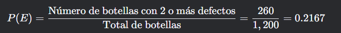
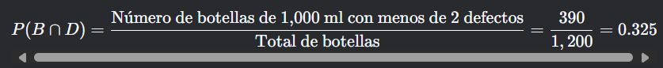
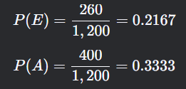
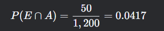
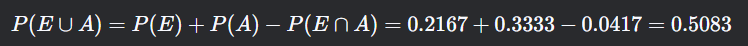
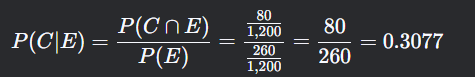

### **Ejemplo Práctico 1: Gaseosas y Defectos en Envases**

#### **Contexto del Problema**

Se tiene un conjunto de **1,200 botellas de gaseosa** que han sido clasificadas según dos criterios:
1. **Capacidad del envase**: 500 ml, 1,000 ml y 1,500 ml.
2. **Defectos en el envase**: Menos de 2 defectos o 2 o más defectos.

El objetivo es calcular varias probabilidades relacionadas con estas botellas utilizando una **tabla de contingencia**.

---

#### **Datos del Problema**

- **Total de botellas**: 1,200.
- **Botellas de 500 ml**: 400.
- **Botellas de 1,500 ml con menos de 2 defectos**: 200.
- **Botellas con 2 o más defectos**: 260.
- **Botellas de 500 ml con menos de 2 defectos**: 350.
- **Botellas de 500 ml con 2 o más defectos**: 80.

---

#### **Construcción de la Tabla de Contingencia**

Primero, organizamos los datos en una tabla de contingencia, donde las **filas** representan los defectos y las **columnas** representan la capacidad de los envases.

| Capacidad | 500 ml (A) | 1,000 ml (B) | 1,500 ml (C) | Totales |
|-----------|------------|--------------|--------------|---------|
| Menos de 2 defectos (D) | 350        | 390          | 200          | 940     |
| 2 o más defectos (E)    | 50         | 130          | 80           | 260     |
| **Totales**             | 400        | 520          | 280          | 1,200   |

---

#### **Cálculo de Probabilidades**

A continuación, se calculan las probabilidades solicitadas utilizando la tabla de contingencia.

---

##### **1. Probabilidad de que una botella tomada al azar sea de 1,500 ml**

- **Evento**: Que la botella sea de 1,500 ml (Evento C).
- **Cálculo**:
  

---

##### **2. Probabilidad de que una botella tomada al azar tenga 2 o más defectos**

- **Evento**: Que la botella tenga 2 o más defectos (Evento E).
- **Cálculo**:
  

---

##### **3. Probabilidad de que una botella tomada al azar sea de 1,000 ml y tenga menos de 2 defectos**

- **Evento**: Que la botella sea de 1,000 ml **y** tenga menos de 2 defectos (Evento B ∩ D).
- **Cálculo**:
  

---

##### **4. Probabilidad de que una botella tomada al azar tenga 2 o más defectos o sea de 500 ml**

- **Evento**: Que la botella tenga 2 o más defectos **o** sea de 500 ml (Evento E ∪ A).
- **Cálculo**:
    - Primero, calculamos las probabilidades individuales:
    - 
    - Luego, calculamos la probabilidad conjunta de que la botella tenga 2 o más defectos **y** sea de 500 ml:
      
    - Finalmente, aplicamos la regla de la adición para eventos no mutuamente excluyentes:
      

---

##### **5. Probabilidad de que una botella sea de 1,500 ml, sabiendo que tiene 2 o más defectos**

- **Evento**: Que la botella sea de 1,500 ml, dado que tiene 2 o más defectos (Evento C | E).
- **Cálculo**:
    - Primero, identificamos el número de botellas de 1,500 ml con 2 o más defectos: 80.
    - Luego, aplicamos la fórmula de probabilidad condicional:
      

---

#### **Interpretación de Resultados**

- **Botellas de 1,500 ml**: Hay un 23.33% de probabilidad de seleccionar una botella de 1,500 ml al azar.
- **Botellas con 2 o más defectos**: Hay un 21.67% de probabilidad de seleccionar una botella con 2 o más defectos.
- **Botellas de 1,000 ml con menos de 2 defectos**: Hay un 32.5% de probabilidad de seleccionar una botella de 1,000 ml que tenga menos de 2 defectos.
- **Botellas con 2 o más defectos o de 500 ml**: Hay un 50.83% de probabilidad de seleccionar una botella que cumpla al menos una de estas dos condiciones.
- **Botellas de 1,500 ml dado que tienen 2 o más defectos**: Si una botella tiene 2 o más defectos, hay un 30.77% de probabilidad de que sea de 1,500 ml.

---

#### **Conclusión**

Este ejemplo ilustra cómo una **tabla de contingencia** puede organizar datos de manera eficiente para calcular probabilidades simples, conjuntas y condicionales. La tabla permite visualizar las relaciones entre las variables (capacidad del envase y defectos) y facilita el cálculo de probabilidades sin necesidad de aplicar fórmulas complejas. Este enfoque es especialmente útil en problemas donde se necesita analizar la relación entre dos variables categóricas.