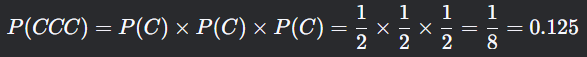

### **Ejemplo Práctico 3: Lanzamiento de una Moneda Tres Veces**

#### **Contexto del Problema**

Se realiza un experimento en el que se lanza una **moneda justa** (es decir, con igual probabilidad de salir cara o cruz) **tres veces**. El objetivo es calcular varias probabilidades relacionadas con los resultados posibles de estos lanzamientos. Para ello, se utiliza un **árbol de decisión** que representa todas las secuencias posibles de resultados.

---

#### **Árbol de Decisión**

El árbol de decisión para este problema tiene **tres niveles**, correspondientes a cada uno de los lanzamientos de la moneda. Cada nivel tiene dos ramas: una para **cara (C)** y otra para **cruz (X)**. Los nodos finales representan los **resultados posibles** del experimento.

**Estructura del Árbol**:
1. **Primer nivel**: Primer lanzamiento (C o X).
2. **Segundo nivel**: Segundo lanzamiento (C o X), dependiendo del resultado del primer lanzamiento.
3. **Tercer nivel**: Tercer lanzamiento (C o X), dependiendo del resultado del segundo lanzamiento.

---

#### **Espacio Muestral**

El espacio muestral (todos los resultados posibles) se compone de **8 combinaciones**, ya que cada lanzamiento tiene 2 resultados posibles y se realizan 3 lanzamientos. Las combinaciones son:

1. **CCC** (Cara, Cara, Cara)
2. **CCX** (Cara, Cara, Cruz)
3. **CXC** (Cara, Cruz, Cara)
4. **CXX** (Cara, Cruz, Cruz)
5. **XCC** (Cruz, Cara, Cara)
6. **XCX** (Cruz, Cara, Cruz)
7. **XXC** (Cruz, Cruz, Cara)
8. **XXX** (Cruz, Cruz, Cruz)

---

#### **Cálculo de Probabilidades**

A continuación, se calculan las probabilidades solicitadas utilizando el árbol de decisión.

---

##### **1. Probabilidad de que salga cara las tres veces (CCC)**

- **Evento**: Que salga cara en los tres lanzamientos (CCC).
- **Cálculo**:
    - La probabilidad de cara en cada lanzamiento es 1 / 2.
    - Como los lanzamientos son independientes, multiplicamos las probabilidades:
      

---

##### **2. Probabilidad de que salga cara en la primera tirada**

- **Evento**: Que salga cara en el primer lanzamiento, independientemente de los resultados de los siguientes lanzamientos.
- **Cálculo**:
    - Hay 4 resultados posibles donde el primer lanzamiento es cara: CCC, CCX, CXC, CXX.
    - Cada uno de estos resultados tiene una probabilidad de 1/8.
    - Sumamos las probabilidades de estos resultados:
      
      

---

##### **3. Probabilidad de que salga cruz las dos primeras tiradas (XX)**

- **Evento**: Que salga cruz en los dos primeros lanzamientos, independientemente del resultado del tercer lanzamiento.
- **Cálculo**:
    - Hay 2 resultados posibles donde los dos primeros lanzamientos son cruz: XXC, XXX.
    - Cada uno de estos resultados tiene una probabilidad de 1/8.
    - Sumamos las probabilidades de estos resultados:
      

---

##### **4. Probabilidad de que por lo menos una vez salga cara**

- **Evento**: Que salga cara al menos una vez en los tres lanzamientos.
- **Cálculo**:
    - Es más fácil calcular la probabilidad del evento complementario (que no salga cara en ningún lanzamiento, es decir, XXX) y restarla de 1.
    - La probabilidad de XXX es 1/8.
    - Por lo tanto:
    - 
---

##### **5. Probabilidad de que salga cruz las tres veces (XXX)**

- **Evento**: Que salga cruz en los tres lanzamientos (XXX).
- **Cálculo**:
    - La probabilidad de cruz en cada lanzamiento es 1/2.
    - Como los lanzamientos son independientes, multiplicamos las probabilidades:
      

---

#### **Interpretación de Resultados**

- **CCC**: Hay un 12.5% de probabilidad de que salga cara las tres veces.
- **Cara en la primera tirada**: Hay un 50% de probabilidad de que salga cara en el primer lanzamiento.
- **Cruz en las dos primeras tiradas**: Hay un 25% de probabilidad de que salga cruz en los dos primeros lanzamientos.
- **Por lo menos una cara**: Hay un 87.5% de probabilidad de que salga cara al menos una vez en los tres lanzamientos.
- **XXX**: Hay un 12.5% de probabilidad de que salga cruz las tres veces.

---

#### **Conclusión**

Este ejemplo ilustra cómo un **árbol de decisión** puede representar de manera clara y estructurada un experimento de pasos múltiples, como el lanzamiento de una moneda tres veces. El árbol permite visualizar todas las secuencias posibles de resultados y facilita el cálculo de probabilidades simples, conjuntas y condicionales. Además, muestra cómo los eventos independientes (cada lanzamiento de la moneda) pueden analizarse de manera secuencial, lo que es especialmente útil en problemas de probabilidad donde los resultados dependen de una serie de pasos o decisiones.