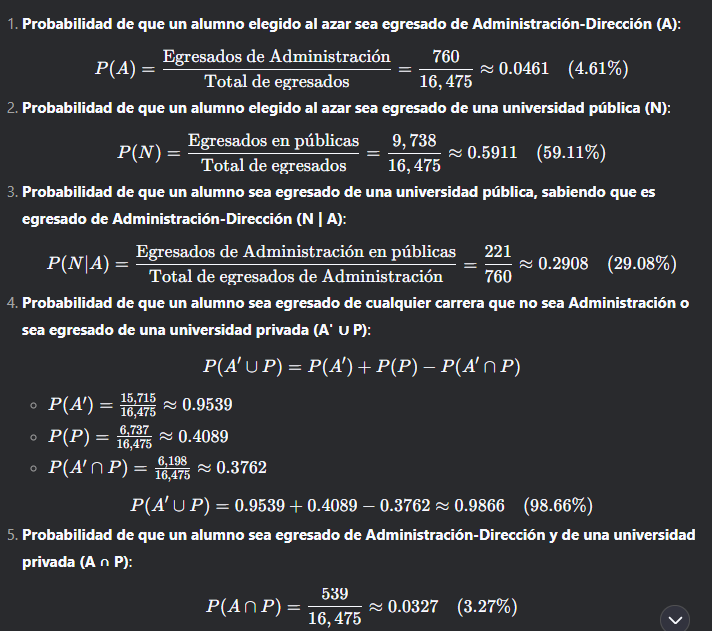
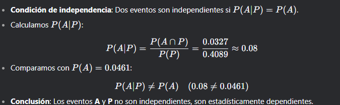

El archivo presenta un **caso práctico** relacionado con los egresados de la Provincia de Córdoba en 2016, donde se analizan las probabilidades de que los estudiantes sean egresados de administración-dirección, de universidades públicas o privadas, entre otros. A continuación, se desarrolla el caso paso a paso con una explicación detallada:

---

### **Caso: Becas de la Fundación Antares para estudiantes de Córdoba**

#### **Datos proporcionados:**
1. **Total de egresados en 2016**: 16,475.
2. **Egresados de Administración-Dirección**: 760.
3. **De los egresados de Administración-Dirección**, el 70.91% son de universidades privadas.
4. **Del total de egresados de la Provincia**, el 59.11% son de universidades públicas.

#### **Definición de eventos:**
- **A**: Egresado de la carrera de Administración-Dirección.
- **A'**: Egresado de otras carreras (no Administración-Dirección).
- **N**: Egresado de una universidad pública.
- **P**: Egresado de una universidad privada.

---

### **Paso 1: Construir la tabla de contingencia**

La tabla de contingencia organiza los datos en filas y columnas, donde las filas representan las carreras (Administración-Dirección y otras) y las columnas representan el tipo de universidad (pública o privada).

| Universidad       | Pública (N) | Privada (P) | Totales |
|--------------------|-------------|-------------|---------|
| Administración (A) | 221         | 539         | 760     |
| Otras (A')         | 9,517       | 6,198       | 15,715  |
| **Totales**        | 9,738       | 6,737       | 16,475  |

#### **Cálculos para completar la tabla:**
1. **Egresados de Administración-Dirección en universidades privadas (P)**:
    - 70.91% de 760 = 0.7091 × 760 ≈ 539.
2. **Egresados de Administración-Dirección en universidades públicas (N)**:
    - Total de egresados de Administración-Dirección = 760.
    - Egresados en privadas = 539.
    - Egresados en públicas = 760 - 539 = 221.
3. **Total de egresados en universidades públicas (N)**:
    - 59.11% de 16,475 = 0.5911 × 16,475 ≈ 9,738.
4. **Egresados de otras carreras en universidades públicas (A' ∩ N)**:
    - Total en públicas = 9,738.
    - Egresados de Administración en públicas = 221.
    - Egresados de otras carreras en públicas = 9,738 - 221 = 9,517.
5. **Egresados de otras carreras en universidades privadas (A' ∩ P)**:
    - Total en privadas = 6,737.
    - Egresados de Administración en privadas = 539.
    - Egresados de otras carreras en privadas = 6,737 - 539 = 6,198.

---

### **Paso 2: Calcular las probabilidades solicitadas**

#### **Parte 1: Probabilidades**
   

---

#### **Parte 2: Independencia de eventos**
Se pregunta si los eventos **A** (egresado de Administración-Dirección) y **P** (egresado de una universidad privada) son independientes.

  

---

### **Paso 3: Resumen de resultados**
- Las probabilidades calculadas permiten tomar decisiones informadas sobre la asignación de becas.
- La tabla de contingencia y los cálculos de probabilidades muestran que los eventos **A** y **P** están relacionados, lo que sugiere que la elección de carrera y el tipo de universidad no son independientes.

---

### **Conclusión general**
Este caso práctico demuestra cómo las **tablas de contingencia** y los **cálculos de probabilidad** pueden utilizarse para analizar datos y tomar decisiones basadas en evidencia. La construcción de la tabla y el cálculo de probabilidades marginales, conjuntas y condicionales son herramientas esenciales en el análisis estadístico.